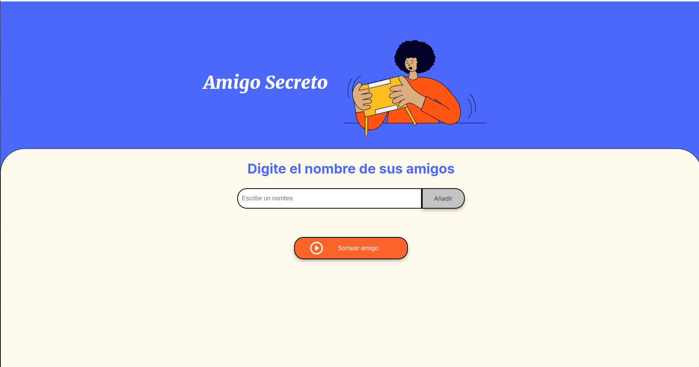
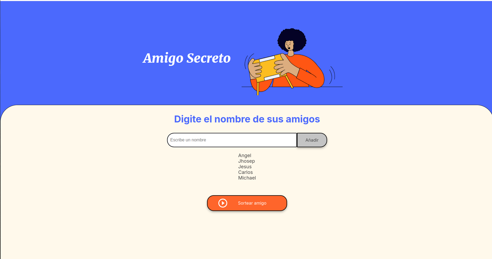
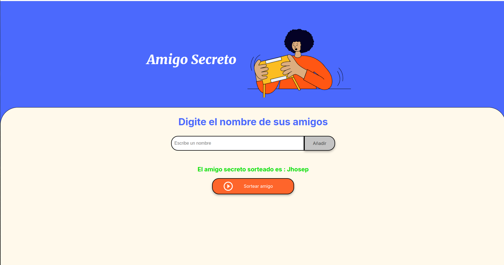

# Challege Amigo Secreto
Este es el primer Challenge de la plataforma de Alura, el objetivo de este Challenge es demostrar lo aprendido en clases las clases anteriores.
El proyecto trata de crear una pagina en la cual se pueda ingresar nombres y mostrarlos en una lista, para luego poder elegir un nombre aleatorio y 
asi mostrarlo como el amigo secreto.

## Funciones del proyecto:
### Funcion agregarAmigo():
Esta funcion se ejecuta al dar click al boton de **Añadir**, en caso de que la casilla de entrada este vacia u contenga numero lanza un alert indicando que la casilla debe de contener un nombre,
en caso que si contenga lo deseado ingresa el nombre a una lista llamada **amigos**.
### Funcion mostrarLista():
Esta funcion muestra los datos ingresados en la lista **amigos**.
### Funcion limpiarElemento():
Lo que realiza esta funcion es recibir el id del elemento para poder borrar los datos del elemento ingresado.
### Funcion sortearAmigo():
Esta funcion es la mas importante pues con esta se da el nombre del amigo secreto, lo que hace es generar un numero aleatorio, que luego va a ser
usado como indice para poder obtener el nombre de la lista **amigos**.Luego muestra el nombre resultante.
### Funcion limpiarCaja():
Limpia los datos de la casilla o caja, cuando ya se a ingresado el nombre.
